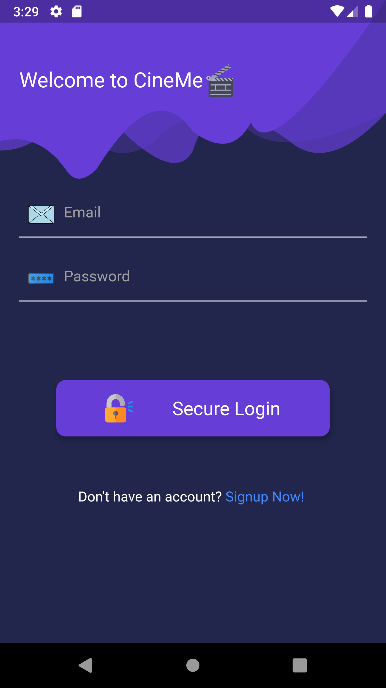
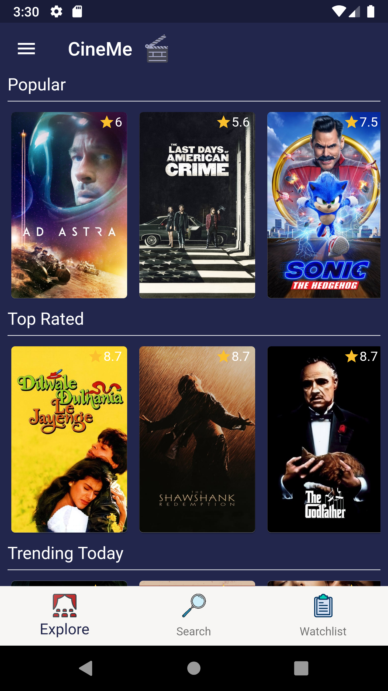
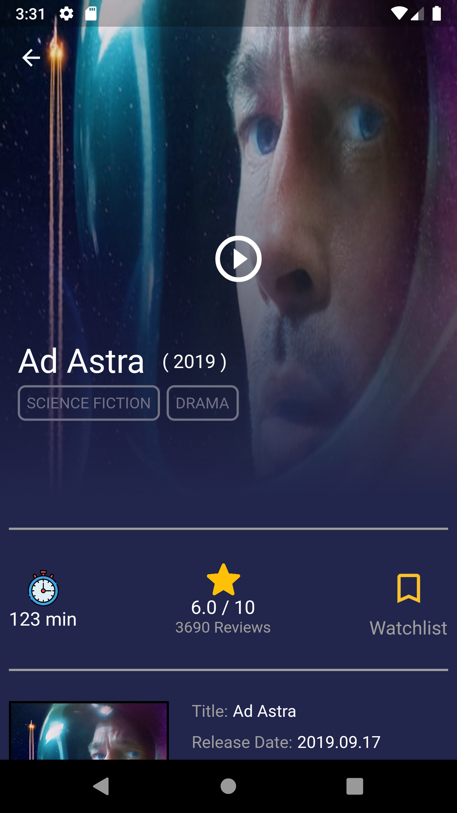
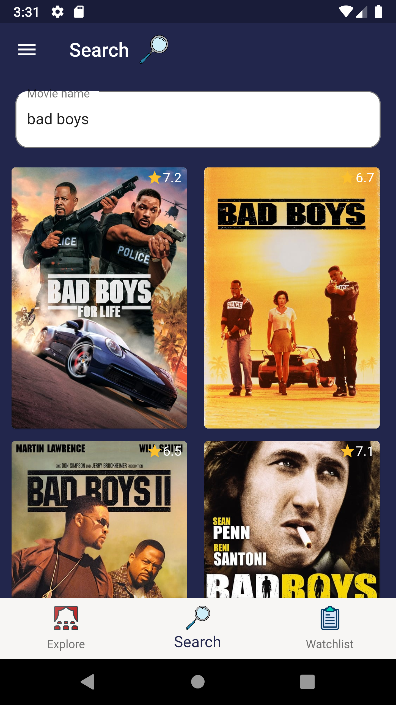
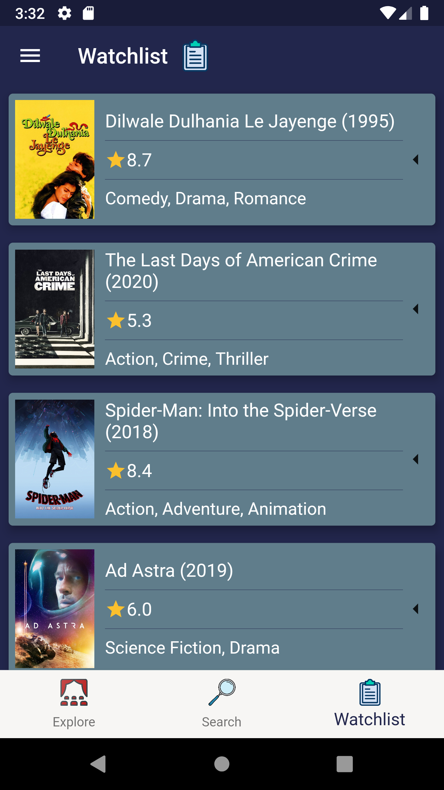
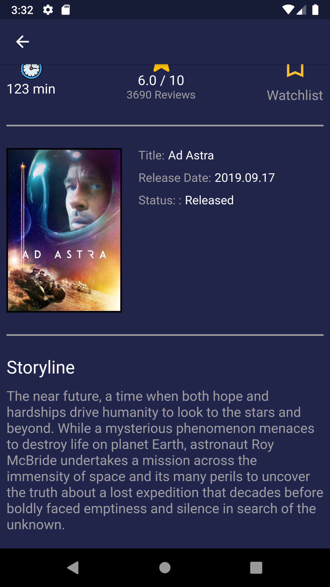
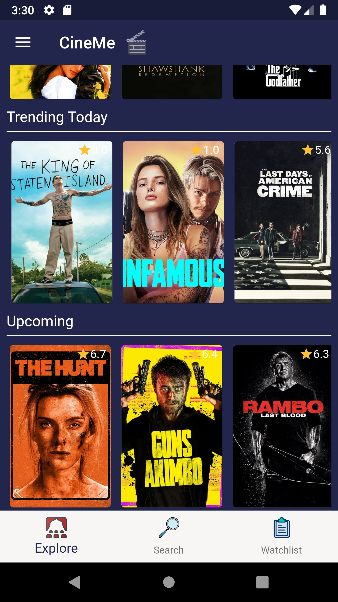

#   CineMe

       

CineMe is a beautiful movies app for android, It is built with Dart on top of Google's Flutter Framework.

CineMe gets its source of movies information from TMDB, By utilizing their [API](https://developers.themoviedb.org/3/getting-started/introduction), it provides the user with fast smooth experience filled with subtle animations and minimal design. The main goal of CineMe is to allow user to explore movies and select their movie for the night- which sometimes is a straggle-. It also uses Google Firebase for user authentication (Google Sign In), Firebase Real-time Database, and Shared Preferences for local settings.

## List of Contents

1. [Features](#features)
2. [ScreenShots](#screenshots)
5. [Development](#development)

## Features

- Search for movies

- Browse movies by categories

- Save movie to watchlist

- Watch movie's trailer

- Explore movie details (poster, story, rate, etc. )
- Application size under 10 MB
- Supports Google Fonts universally
- Optimised storage using minimal packages

## Screenshots
|  | |   |
|:------------:|:------------:| :------------:|
| Authentication |Explore | Movie Detail

|  |   | |  
|:------------:|:------------:| :------------:|
|Search | Watchlist |More movie detail 
|  |

|More Explore 

  

## Dependencies

The following packages are needed for the development of this application.

- `google_fonts: ^1.1.0` for beautiful fonts
- `shared_preferences: ^0.5.7+3` for storing settings
-  `  provider: ^4.1.1` for managing the state
-  ` http: ^0.12.1` for sending HTTP request to the API
-  `flutter_youtube: ^2.0.0`  for youtube web view

More details about these can be found in the [`pubspec.yaml`](https://github.com/Abdulaziz4/CineMe/blob/master/pubspec.yaml) file.

## Development

Start by forking the repository, and then run `flutter pub get` in the local repository. 
>Note: This project requires Flutter Framework to be installed on your machine.
